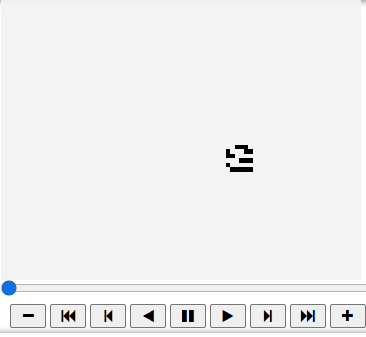
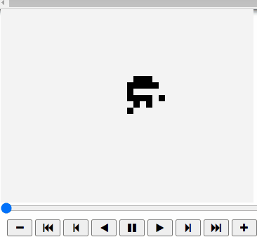

# methuselah_evolution
The program implements a genetic algorithm to find impressive methuselahs in the game of life. 

The Conway's game of life and methuselahs:
The game of life is a cellular automata devised by John Conway. It is a two dimensional grid, where each cell can be in two cells - dead or alive. The cells change configurations according to a simple set of rules (for further information read - https://en.wikipedia.org/wiki/Conway%27s_Game_of_Life).
Metuselah in the game of life are starting configurations that start as small, but grow big and live a long time before finally setteling to a oscillating or stedy state (read more here - https://conwaylife.com/wiki/Methuselah).

The algorithm:
The program uses an evolutionary algorithm to try and find impressive methuselahs. 
In general, genetic algorithms use a population of possible solutions for the problem encoutered. Each solution has a calculated fitness according to a fitness function. Every generation individual solutions are chosen as parents and create new solutions that will populate the next population. The chance to choose an individual as a parent is relative to its fitness - the they are, the greater their chance to be chosen. As generations pass, the algorithm sould converge towards an optimal solution (or to a local optimum) (continue to read here - https://en.wikipedia.org/wiki/Genetic_algorithm)
In this program, every individual is a starting configuration. The fitness of each individual is calculated considering three parameters - the size of the initial configurations (number of living cells), the maximal size of the automata, and its life span. The parents are chosen using roulette choice, and the recombination is of three different boards (to avoid early convergence). To avoid losing good solutions, the programs saves the best solution from the previous generation to the next generation (elitism). In this fashion a fixed amount of generations evolve to produce a methuselah.

The program:
The user can choose whether to see solutions from previous runs of the algorithm or to find a new methuselah with the algorithm (takes some time). The second choice presents a graph of the evolution of the population, and a simulation of the best methuselah produced by the algorithm.

An example of a run from the second choice (evolution of a new methuselah):

An animation of a metuselah produced by this run of the program:

An interesting behaviour of the genetic algotrithm is its flexibility to certain changes. For example, if you would prefer to produce different kinds 
of configurations, all you need to do is change the fitness function. In one accasion I wanted to see methuselahs that both start and end with small configurations.
So, I added the size of the final configuration to the denominator, and ran the program. The program produced the following methuselah:

The disappearing ninja:

